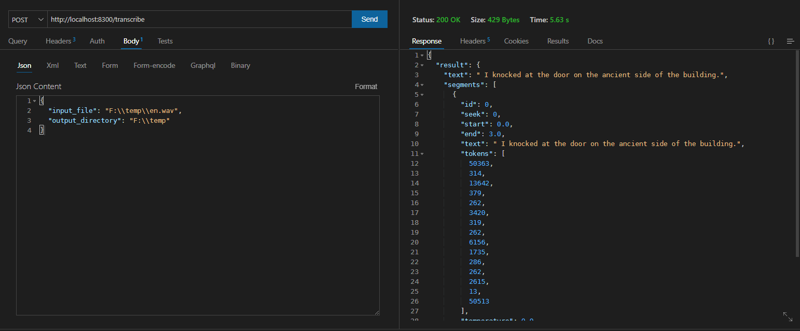

<p align="center">
    
</p>

<div align="center">
</div>
 
# Introduction

This is a Whisper API server.

# Usage

- Download it from [release](https://github.com/rerender2021/Whisper-API/releases)

- Unzip it, and click `run.bat`


# API

- Default host: `http://localhost:8300`
  
## POST /transcribe

- Description: generate subtitle
- Example:



# Dev

- Install

```bash
> virtualenv venv --python=python3.8.10
> pip install -r requirements.txt
```

- Download model from https://github.com/openai/whisper/discussions/63#discussioncomment-3798552

Then, adjust `model` folder structure like this:

```
- ...
- model
    - base.en.pt
    - base.pt
- ...
- README.md
```

- Run

```bash
> dev
```

# Package

```bash
> build
```

# License

[MIT](./LICENSE)
